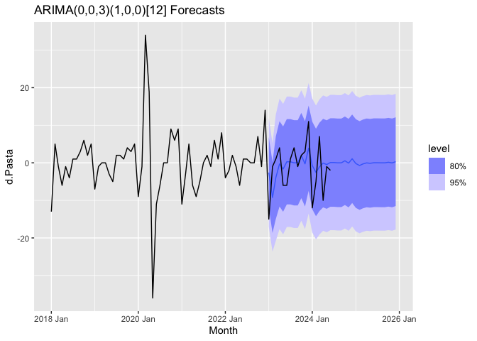

Predicting Pasta Passion: Time Series Analysis of Google Searches in
Italy
================
Elena Del Governatore

- [Libraries](#libraries)
- [Introduction](#introduction)
  - [Objective](#objective)
  - [Data Collection](#data-collection)
- [Exploratory Data Analysis](#exploratory-data-analysis)
  - [ACF and PACF](#acf-and-pacf)
  - [Decomposition](#decomposition)
  - [Box-Cox Transformation](#box-cox-transformation)
- [Data Preparation: Stationarity](#data-preparation-stationarity)
  - [Unit Root Tests: ADF and KPSS](#unit-root-tests-adf-and-kpss)
  - [Differencing Data](#differencing-data)
  - [Structural Break Test](#structural-break-test)
  - [Shortening Time Series](#shortening-time-series)
- [The Differentiated Series](#the-differentiated-series)
  - [ACF and PACF](#acf-and-pacf-1)
- [Splitting: Train and Test Sets](#splitting-train-and-test-sets)
- [Models - ARIMA and ETS](#models---arima-and-ets)
  - [Model Evaluation](#model-evaluation)
  - [Model Forecasts](#model-forecasts)

# Libraries

``` r
# Load libraries
library(AER)
```

    ## Loading required package: car

    ## Loading required package: carData

    ## Loading required package: lmtest

    ## Loading required package: zoo

    ## 
    ## Attaching package: 'zoo'

    ## The following objects are masked from 'package:base':
    ## 
    ##     as.Date, as.Date.numeric

    ## Loading required package: sandwich

    ## Loading required package: survival

``` r
library(ggplot2)
library(tsibble) 
```

    ## 
    ## Attaching package: 'tsibble'

    ## The following object is masked from 'package:zoo':
    ## 
    ##     index

    ## The following objects are masked from 'package:base':
    ## 
    ##     intersect, setdiff, union

``` r
library(dplyr)
```

    ## 
    ## Attaching package: 'dplyr'

    ## The following object is masked from 'package:car':
    ## 
    ##     recode

    ## The following objects are masked from 'package:stats':
    ## 
    ##     filter, lag

    ## The following objects are masked from 'package:base':
    ## 
    ##     intersect, setdiff, setequal, union

``` r
library(fpp3)
```

    ## ── Attaching packages ────────────────────────────────────────────── fpp3 0.5 ──

    ## ✔ tibble      3.2.1     ✔ feasts      0.3.1
    ## ✔ tidyr       1.3.0     ✔ fable       0.3.3
    ## ✔ lubridate   1.9.3     ✔ fabletools  0.4.1
    ## ✔ tsibbledata 0.4.1

    ## ── Conflicts ───────────────────────────────────────────────── fpp3_conflicts ──
    ## ✖ lubridate::date()     masks base::date()
    ## ✖ dplyr::filter()       masks stats::filter()
    ## ✖ tsibble::index()      masks zoo::index()
    ## ✖ tsibble::intersect()  masks base::intersect()
    ## ✖ lubridate::interval() masks tsibble::interval()
    ## ✖ dplyr::lag()          masks stats::lag()
    ## ✖ dplyr::recode()       masks car::recode()
    ## ✖ tsibble::setdiff()    masks base::setdiff()
    ## ✖ tsibble::union()      masks base::union()

``` r
library(forecast)
```

    ## Registered S3 method overwritten by 'quantmod':
    ##   method            from
    ##   as.zoo.data.frame zoo

``` r
library(tidyverse,warn.conflicts=FALSE) 
```

    ## ── Attaching core tidyverse packages ──────────────────────── tidyverse 2.0.0 ──
    ## ✔ forcats 1.0.0     ✔ readr   2.1.4
    ## ✔ purrr   1.0.2     ✔ stringr 1.5.1

    ## ── Conflicts ────────────────────────────────────────── tidyverse_conflicts() ──
    ## ✖ dplyr::filter()       masks stats::filter()
    ## ✖ lubridate::interval() masks tsibble::interval()
    ## ✖ dplyr::lag()          masks stats::lag()
    ## ✖ dplyr::recode()       masks car::recode()
    ## ✖ purrr::some()         masks car::some()
    ## ℹ Use the conflicted package (<http://conflicted.r-lib.org/>) to force all conflicts to become errors

``` r
library(urca)

library(fable)
library(fabletools)
library(feasts)
library(strucchange)
```

    ## 
    ## Attaching package: 'strucchange'
    ## 
    ## The following object is masked from 'package:stringr':
    ## 
    ##     boundary

``` r
library(zoo)
```

# Introduction

## Objective

The analysis aims at forecasting future interest in pasta, by analzying
evolving patterns in search for “pasta” by Google users in Italy. By
employing time series forecasting techniques i.e. **Exponential
Smoothing (ETS)** and **AutoRegressive Integrated Moving Average
(ARIMA)** models, the study helps forcast future interest in pasta.

## Data Collection

The dataset, sourced from Google Trends, includes 246 observations
spanning from 2004 to the present day, tracking the relative frequency
of searches for “pasta” in Italy.

<div class="kable-table">

| Month   | Pasta |
|:--------|------:|
| 2004-01 |    10 |
| 2004-02 |     9 |
| 2004-03 |     9 |
| 2004-04 |     9 |
| 2004-05 |     9 |
| 2004-06 |     9 |

</div>

# Exploratory Data Analysis

``` r
# Convert Month to yearmonth format and create tsibble
df_ts <- df %>%
  mutate(Month = yearmonth(Month)) %>%
  as_tsibble(index = Month) %>%
  fill_gaps()

# Check for missing months and remove any remaining NAs
df_ts <- df_ts %>%
  fill_gaps() %>%
  filter(!is.na(Pasta))

# Verify the tsibble structure and content
print(df_ts)
```

    ## # A tsibble: 246 x 2 [1M]
    ##       Month Pasta
    ##       <mth> <int>
    ##  1 2004 Jan    10
    ##  2 2004 Feb     9
    ##  3 2004 Mar     9
    ##  4 2004 Apr     9
    ##  5 2004 May     9
    ##  6 2004 Jun     9
    ##  7 2004 Jul    10
    ##  8 2004 Aug    10
    ##  9 2004 Sep     9
    ## 10 2004 Oct    10
    ## # ℹ 236 more rows

``` r
# Plot 
plot.1 <- df_ts %>%
  filter(!is.na(Pasta)) %>% # Ignore NAs 
  autoplot(Pasta) + 
  labs(title = "Pasta Search Requests on Google", x = "Date", y = "Search Requests of Pasta") +
  theme_minimal()

print(plot.1) 
```

<!-- -->

## ACF and PACF

``` r
#Remove null values in the gdp growth variable 
Pasta_growth <- na.omit(df_ts$Pasta)

# Calculate the autocorrelation of the "gap" variable
acf <- acf(Pasta_growth, plot = FALSE)
pacf <- pacf(Pasta_growth, plot = FALSE)

# Plot the autocorrelation
plot(acf, 
     main = "Pasta ACF", 
     xlab = "Lag", 
     ylab = "ACF") 
```

<!-- -->

``` r
plot(pacf, 
     main = "Pasta PACF", 
     xlab = "Lag", 
     ylab = "ACF") 
```

<!-- -->

- ACF shows clear indications of non stationarity in the data, indeed
  all the lags are significant meaning autocorrelation persists over
  many lags.

- PACF shows one very significant lag (very close to 1).

## Decomposition

``` r
# Perform STL decomposition for monthly data
stl_decomp <- df_ts %>%
  model(STL(Pasta ~ season(window = "periodic"))) 

# Extract components
components <- stl_decomp %>%
  components()

# Plot components
autoplot(components) + ggtitle("Decomposition of the Time Series Using STL ")
```

<!-- -->

- Trend:
  - Upward Trend (2004 to 2020): steady increase in search interest for
    “pasta” was observed until 2020
  - Post-2020 Flattening: trend flattens and slightly declines after
    2020.
  - COVID-19 Impact: a sharp spike in search interest during 2020
    coincides with the COVID-19 pandemic.
- Seasonal Patterns: regular, periodic fluctuations reflect strong
  seasonality, with peaks and troughs occurring consistently across
  years.
- Residual Analysis:residuals are small and centered around zero, except
  for a significant anomaly in 2020, potentially attributed to the
  pandemic-driven surge in searches.

``` r
# check: closer look at seasonality 
 seasoon <- df_ts %>% 
   select(Pasta) %>% 
   as.ts %>% 
   ggseasonplot() + 
   ggtitle("Seasonality in Pasta Searches")+ 
   theme_minimal() 
 
 
 df_ts |>
  gg_subseries(Pasta)
```

<!-- -->

Key insights:

- Seasonal patterns repeat consistently across years.

- December and April: Notable peaks in interest for “pasta.”

- June to August: Periods of reduced search activity.

``` r
# Kruskal-Wallis Test
kruskal.test(Pasta ~ month(Month), data = df_ts)
```

    ## 
    ##  Kruskal-Wallis rank sum test
    ## 
    ## data:  Pasta by month(Month)
    ## Kruskal-Wallis chi-squared = 12.918, df = 11, p-value = 0.2987

Insight: significant p-value of 0.2987 indicates significant differences
in search interest between different months, supporting the presence of
seasonality.

## Box-Cox Transformation

``` r
lambda <- df_ts |>
  features(Pasta, features = guerrero) |>
  pull(lambda_guerrero)

lambda
```

    ## [1] -0.4021361

Based on the lambda obtained, data would benefit from an inverse power
transformation to stabilize the variance. The specific transformation
suggested by Guerrero’s method is a Box-Cox transformation with a lambda
of -0.4021361.

``` r
# Apply Box-Cox transformation
pasta_transformed <- BoxCox(df_ts$Pasta, lambda = lambda)

# Add the transformed data to your tsibble
df_ts <- df_ts %>%
  mutate(Pasta_transformed = pasta_transformed)
```

``` r
# Plot the transformed data to inspect
autoplot(df_ts, Pasta_transformed) +
  labs(title = "Box-Cox Transformed Pasta Data",
       y = "Transformed Search Interest",
       x = "Month")+
  theme_minimal()
```

<!-- -->

``` r
# Calculate the autocorrelation of the "gap" variable
autocorrelation2 <- acf(df_ts$Pasta_transformed, plot = FALSE)

# Plot the autocorrelation
plot(autocorrelation2, 
     main = "ACF of Pasta", 
     xlab = "Lag", 
     ylab = "ACF") 
```

<!-- -->

Even after transformation, high autocorrelation persist. Therefore the
log transformation was not sufficient significantly reduce variance.

# Data Preparation: Stationarity

## Unit Root Tests: ADF and KPSS

ADF and KPSS tests are used to test for stationarity in the data.

``` r
pasta_ts <- df_ts %>% select(Pasta) %>% as.ts()
```

### With no drift and trend

``` r
# KPSS including nothing
summary(ur.kpss(pasta_ts, type = "mu"))
```

    ## 
    ## ####################### 
    ## # KPSS Unit Root Test # 
    ## ####################### 
    ## 
    ## Test is of type: mu with 5 lags. 
    ## 
    ## Value of test-statistic is: 3.956 
    ## 
    ## Critical value for a significance level of: 
    ##                 10pct  5pct 2.5pct  1pct
    ## critical values 0.347 0.463  0.574 0.739

``` r
# ADF test with nothing
adf_none <- ur.df(pasta_ts, type = "none", lag= 24, selectlags = "AIC")
summary(adf_none)
```

    ## 
    ## ############################################### 
    ## # Augmented Dickey-Fuller Test Unit Root Test # 
    ## ############################################### 
    ## 
    ## Test regression none 
    ## 
    ## 
    ## Call:
    ## lm(formula = z.diff ~ z.lag.1 - 1 + z.diff.lag)
    ## 
    ## Residuals:
    ##     Min      1Q  Median      3Q     Max 
    ## -15.858  -1.009   0.264   1.697  32.638 
    ## 
    ## Coefficients:
    ##              Estimate Std. Error t value Pr(>|t|)    
    ## z.lag.1       0.01541    0.00885   1.741 0.083247 .  
    ## z.diff.lag1  -0.21617    0.07130  -3.032 0.002757 ** 
    ## z.diff.lag2  -0.43367    0.07149  -6.066 6.59e-09 ***
    ## z.diff.lag3  -0.35086    0.07905  -4.439 1.51e-05 ***
    ## z.diff.lag4  -0.31581    0.08133  -3.883 0.000141 ***
    ## z.diff.lag5  -0.33878    0.08453  -4.008 8.70e-05 ***
    ## z.diff.lag6  -0.28511    0.08757  -3.256 0.001332 ** 
    ## z.diff.lag7  -0.22565    0.08963  -2.518 0.012614 *  
    ## z.diff.lag8  -0.06951    0.09116  -0.763 0.446654    
    ## z.diff.lag9  -0.16933    0.09127  -1.855 0.065066 .  
    ## z.diff.lag10 -0.07861    0.09197  -0.855 0.393724    
    ## z.diff.lag11 -0.04494    0.09173  -0.490 0.624692    
    ## z.diff.lag12  0.32694    0.08977   3.642 0.000346 ***
    ## z.diff.lag13 -0.09426    0.09306  -1.013 0.312390    
    ## z.diff.lag14  0.07837    0.09342   0.839 0.402559    
    ## z.diff.lag15 -0.02069    0.09264  -0.223 0.823479    
    ## z.diff.lag16 -0.03403    0.09293  -0.366 0.714635    
    ## z.diff.lag17 -0.03693    0.09135  -0.404 0.686414    
    ## z.diff.lag18 -0.15619    0.09058  -1.724 0.086223 .  
    ## z.diff.lag19 -0.14776    0.08838  -1.672 0.096121 .  
    ## z.diff.lag20 -0.22562    0.08567  -2.634 0.009121 ** 
    ## z.diff.lag21 -0.14201    0.08429  -1.685 0.093597 .  
    ## z.diff.lag22 -0.17982    0.07658  -2.348 0.019852 *  
    ## z.diff.lag23 -0.21825    0.07725  -2.825 0.005209 ** 
    ## ---
    ## Signif. codes:  0 '***' 0.001 '**' 0.01 '*' 0.05 '.' 0.1 ' ' 1
    ## 
    ## Residual standard error: 4.314 on 197 degrees of freedom
    ## Multiple R-squared:  0.4195, Adjusted R-squared:  0.3488 
    ## F-statistic: 5.932 on 24 and 197 DF,  p-value: 1.829e-13
    ## 
    ## 
    ## Value of test-statistic is: 1.741 
    ## 
    ## Critical values for test statistics: 
    ##       1pct  5pct 10pct
    ## tau1 -2.58 -1.95 -1.62

``` r
# Note: 24 lags used because it is a monthly time series 
```

Both tests suggested the presence of a unit root, indicating
non-stationary data, at all critical values.

### Including a trend and drift terms

``` r
# KPSS including a trend

summary(ur.kpss(pasta_ts, type = "tau"))
```

    ## 
    ## ####################### 
    ## # KPSS Unit Root Test # 
    ## ####################### 
    ## 
    ## Test is of type: tau with 5 lags. 
    ## 
    ## Value of test-statistic is: 0.3646 
    ## 
    ## Critical value for a significance level of: 
    ##                 10pct  5pct 2.5pct  1pct
    ## critical values 0.119 0.146  0.176 0.216

``` r
#with drift
adf_drift <- ur.df(pasta_ts, type = "drift", lag= 24, selectlags = "AIC")
# with trend
adf_trend <- ur.df(pasta_ts, type = "trend", lag= 24, selectlags = "AIC")

summary(adf_drift)
```

    ## 
    ## ############################################### 
    ## # Augmented Dickey-Fuller Test Unit Root Test # 
    ## ############################################### 
    ## 
    ## Test regression drift 
    ## 
    ## 
    ## Call:
    ## lm(formula = z.diff ~ z.lag.1 + 1 + z.diff.lag)
    ## 
    ## Residuals:
    ##     Min      1Q  Median      3Q     Max 
    ## -14.507  -1.483  -0.198   1.380  32.715 
    ## 
    ## Coefficients:
    ##              Estimate Std. Error t value Pr(>|t|)    
    ## (Intercept)   1.57646    0.70858   2.225 0.027233 *  
    ## z.lag.1      -0.01941    0.01793  -1.082 0.280500    
    ## z.diff.lag1  -0.20304    0.07084  -2.866 0.004608 ** 
    ## z.diff.lag2  -0.42292    0.07095  -5.961 1.15e-08 ***
    ## z.diff.lag3  -0.34852    0.07828  -4.452 1.42e-05 ***
    ## z.diff.lag4  -0.31888    0.08054  -3.960 0.000105 ***
    ## z.diff.lag5  -0.34705    0.08378  -4.142 5.11e-05 ***
    ## z.diff.lag6  -0.29998    0.08697  -3.449 0.000688 ***
    ## z.diff.lag7  -0.24577    0.08920  -2.755 0.006420 ** 
    ## z.diff.lag8  -0.09546    0.09101  -1.049 0.295509    
    ## z.diff.lag9  -0.19533    0.09112  -2.144 0.033300 *  
    ## z.diff.lag10 -0.11015    0.09216  -1.195 0.233461    
    ## z.diff.lag11 -0.07598    0.09189  -0.827 0.409281    
    ## z.diff.lag12  0.29063    0.09037   3.216 0.001520 ** 
    ## z.diff.lag13 -0.12142    0.09295  -1.306 0.192992    
    ## z.diff.lag14  0.05077    0.09333   0.544 0.587081    
    ## z.diff.lag15 -0.04351    0.09230  -0.471 0.637876    
    ## z.diff.lag16 -0.05591    0.09253  -0.604 0.546377    
    ## z.diff.lag17 -0.05575    0.09084  -0.614 0.540128    
    ## z.diff.lag18 -0.17105    0.08994  -1.902 0.058656 .  
    ## z.diff.lag19 -0.16161    0.08772  -1.842 0.066953 .  
    ## z.diff.lag20 -0.23740    0.08499  -2.793 0.005737 ** 
    ## z.diff.lag21 -0.15480    0.08365  -1.850 0.065751 .  
    ## z.diff.lag22 -0.18835    0.07592  -2.481 0.013945 *  
    ## z.diff.lag23 -0.22947    0.07665  -2.994 0.003110 ** 
    ## ---
    ## Signif. codes:  0 '***' 0.001 '**' 0.01 '*' 0.05 '.' 0.1 ' ' 1
    ## 
    ## Residual standard error: 4.271 on 196 degrees of freedom
    ## Multiple R-squared:  0.4334, Adjusted R-squared:  0.364 
    ## F-statistic: 6.246 on 24 and 196 DF,  p-value: 3.012e-14
    ## 
    ## 
    ## Value of test-statistic is: -1.0822 4.0208 
    ## 
    ## Critical values for test statistics: 
    ##       1pct  5pct 10pct
    ## tau2 -3.46 -2.88 -2.57
    ## phi1  6.52  4.63  3.81

``` r
summary(adf_trend)
```

    ## 
    ## ############################################### 
    ## # Augmented Dickey-Fuller Test Unit Root Test # 
    ## ############################################### 
    ## 
    ## Test regression trend 
    ## 
    ## 
    ## Call:
    ## lm(formula = z.diff ~ z.lag.1 + 1 + tt + z.diff.lag)
    ## 
    ## Residuals:
    ##     Min      1Q  Median      3Q     Max 
    ## -14.477  -1.449  -0.157   1.432  32.647 
    ## 
    ## Coefficients:
    ##               Estimate Std. Error t value Pr(>|t|)    
    ## (Intercept)   1.521873   0.725481   2.098  0.03722 *  
    ## z.lag.1      -0.049785   0.084507  -0.589  0.55646    
    ## tt            0.007882   0.021426   0.368  0.71337    
    ## z.diff.lag1  -0.174406   0.105358  -1.655  0.09946 .  
    ## z.diff.lag2  -0.395084   0.103832  -3.805  0.00019 ***
    ## z.diff.lag3  -0.322669   0.105323  -3.064  0.00250 ** 
    ## z.diff.lag4  -0.293849   0.105574  -2.783  0.00591 ** 
    ## z.diff.lag5  -0.323769   0.105141  -3.079  0.00237 ** 
    ## z.diff.lag6  -0.277870   0.105873  -2.625  0.00936 ** 
    ## z.diff.lag7  -0.224614   0.106304  -2.113  0.03588 *  
    ## z.diff.lag8  -0.074788   0.107125  -0.698  0.48592    
    ## z.diff.lag9  -0.175712   0.105759  -1.661  0.09823 .  
    ## z.diff.lag10 -0.090767   0.106333  -0.854  0.39437    
    ## z.diff.lag11 -0.057655   0.104706  -0.551  0.58252    
    ## z.diff.lag12  0.309449   0.104011   2.975  0.00330 ** 
    ## z.diff.lag13 -0.103294   0.105385  -0.980  0.32822    
    ## z.diff.lag14  0.067662   0.104201   0.649  0.51688    
    ## z.diff.lag15 -0.027246   0.102528  -0.266  0.79072    
    ## z.diff.lag16 -0.040734   0.101501  -0.401  0.68862    
    ## z.diff.lag17 -0.041493   0.098941  -0.419  0.67541    
    ## z.diff.lag18 -0.159201   0.095713  -1.663  0.09785 .  
    ## z.diff.lag19 -0.150589   0.092880  -1.621  0.10656    
    ## z.diff.lag20 -0.228586   0.088482  -2.583  0.01051 *  
    ## z.diff.lag21 -0.147080   0.086422  -1.702  0.09037 .  
    ## z.diff.lag22 -0.182915   0.077506  -2.360  0.01926 *  
    ## z.diff.lag23 -0.224949   0.077798  -2.891  0.00427 ** 
    ## ---
    ## Signif. codes:  0 '***' 0.001 '**' 0.01 '*' 0.05 '.' 0.1 ' ' 1
    ## 
    ## Residual standard error: 4.281 on 195 degrees of freedom
    ## Multiple R-squared:  0.4338, Adjusted R-squared:  0.3612 
    ## F-statistic: 5.975 on 25 and 195 DF,  p-value: 7.253e-14
    ## 
    ## 
    ## Value of test-statistic is: -0.5891 2.7138 0.6506 
    ## 
    ## Critical values for test statistics: 
    ##       1pct  5pct 10pct
    ## tau3 -3.99 -3.43 -3.13
    ## phi2  6.22  4.75  4.07
    ## phi3  8.43  6.49  5.47

- KPSS Test (Tau Parameter):

  - The null hypothesis of stationarity was rejected at all significance
    levels, indicating non-stationarity in the data.

- ADF Test:

  - With the “trend” parameter (tau3):

    - Failed to reject the null hypothesis at all critical values,
      indicating the presence of a unit root and non-stationarity.

  - With “phi2” and “phi3” parameters:

    - Rejected the null hypotheses, suggesting the data follows a random
      walk with both a trend and drift.

  - With the “drift” parameter (tau2):

    - Failed to reject the null hypothesis, indicating a unit root.

    - Phi1 results: Rejected the null hypothesis of a unit root without
      drift, confirming the presence of a drift.

## Differencing Data

In the original series, results showed a significant intercept both in
the drift model and in the trend model. This suggests there might have
been a drift component as well as a trend component in the original
series that resulted in non-stationarity. This will be addressed by
differencing data.

``` r
# how many differencing are needed 
ndiffs(pasta_ts)
```

    ## [1] 1

``` r
# whether seasonal differencing is needed
nsdiffs(pasta_ts)
```

    ## [1] 0

``` r
# first difference 
df_ts %>%
  mutate(d.Pasta = difference(Pasta)) -> df_ts

d_pasta = df_ts%>% 
  select(d.Pasta) %>% 
  filter(!is.na(d.Pasta)) %>% 
  as.ts() 

# unit root tests 
summary(ur.kpss(d_pasta, type = 'mu'))
```

    ## 
    ## ####################### 
    ## # KPSS Unit Root Test # 
    ## ####################### 
    ## 
    ## Test is of type: mu with 5 lags. 
    ## 
    ## Value of test-statistic is: 0.0396 
    ## 
    ## Critical value for a significance level of: 
    ##                 10pct  5pct 2.5pct  1pct
    ## critical values 0.347 0.463  0.574 0.739

``` r
adf_none_d1 <- ur.df(d_pasta, type = "none", lag= 24, selectlags = "AIC")
summary(adf_none_d1)
```

    ## 
    ## ############################################### 
    ## # Augmented Dickey-Fuller Test Unit Root Test # 
    ## ############################################### 
    ## 
    ## Test regression none 
    ## 
    ## 
    ## Call:
    ## lm(formula = z.diff ~ z.lag.1 - 1 + z.diff.lag)
    ## 
    ## Residuals:
    ##     Min      1Q  Median      3Q     Max 
    ## -17.082  -0.835   0.469   1.944  33.291 
    ## 
    ## Coefficients:
    ##              Estimate Std. Error t value Pr(>|t|)    
    ## z.lag.1      -3.07598    0.86492  -3.556 0.000471 ***
    ## z.diff.lag1   1.90547    0.84759   2.248 0.025683 *  
    ## z.diff.lag2   1.51485    0.83097   1.823 0.069828 .  
    ## z.diff.lag3   1.20742    0.81182   1.487 0.138545    
    ## z.diff.lag4   0.94362    0.79095   1.193 0.234301    
    ## z.diff.lag5   0.65274    0.77043   0.847 0.397894    
    ## z.diff.lag6   0.41537    0.74924   0.554 0.579941    
    ## z.diff.lag7   0.23702    0.72748   0.326 0.744912    
    ## z.diff.lag8   0.20606    0.70515   0.292 0.770421    
    ## z.diff.lag9   0.08788    0.68037   0.129 0.897360    
    ## z.diff.lag10  0.04519    0.65495   0.069 0.945066    
    ## z.diff.lag11  0.05879    0.62476   0.094 0.925132    
    ## z.diff.lag12  0.40851    0.59445   0.687 0.492763    
    ## z.diff.lag13  0.36723    0.55477   0.662 0.508780    
    ## z.diff.lag14  0.50577    0.51079   0.990 0.323305    
    ## z.diff.lag15  0.54899    0.46444   1.182 0.238616    
    ## z.diff.lag16  0.56844    0.41775   1.361 0.175169    
    ## z.diff.lag17  0.59666    0.36572   1.631 0.104392    
    ## z.diff.lag18  0.50830    0.31405   1.619 0.107151    
    ## z.diff.lag19  0.42883    0.26141   1.640 0.102521    
    ## z.diff.lag20  0.26856    0.21150   1.270 0.205667    
    ## z.diff.lag21  0.18419    0.16293   1.130 0.259678    
    ## z.diff.lag22  0.07417    0.11420   0.649 0.516813    
    ## z.diff.lag23 -0.11367    0.07802  -1.457 0.146763    
    ## ---
    ## Signif. codes:  0 '***' 0.001 '**' 0.01 '*' 0.05 '.' 0.1 ' ' 1
    ## 
    ## Residual standard error: 4.335 on 196 degrees of freedom
    ## Multiple R-squared:  0.7094, Adjusted R-squared:  0.6738 
    ## F-statistic: 19.94 on 24 and 196 DF,  p-value: < 2.2e-16
    ## 
    ## 
    ## Value of test-statistic is: -3.5564 
    ## 
    ## Critical values for test statistics: 
    ##       1pct  5pct 10pct
    ## tau1 -2.58 -1.95 -1.62

According to both KPSS and ADF, the test statistic is less than all
critical values indicating that the series has achieved stationarity
after differencing once.

## Structural Break Test

Previous findings suggested a significant change in pasta-search in
March 2020 i.e. beginning of the COVID-19 pandemic. This may result in a
structural break.

Therefore, structural breaks are tested using the QLR test.

``` r
# Convert the differenced series to a zoo object
d_pasta_zoo <- as.zoo(d_pasta)


#  lagged time series  with appropriate lags
lagged_pasta_ts <- cbind(
  Lag0 = d_pasta,
  Lag1 = stats::lag(d_pasta, -1),
  Lag2 = stats::lag(d_pasta, -2)
)

# Convert the lagged series to a data frame
lagged_pasta_df <- as.data.frame(lagged_pasta_ts)

# Ensure there are no NA values in the lagged data frame
lagged_pasta_df <- na.omit(lagged_pasta_df)

# Perform the structural break test using Fstats
qlr <- Fstats(Lag0 ~ Lag1 + Lag2, data = lagged_pasta_df, from = 0.1) # 10% confidence level

# SupF test
test <- sctest(qlr, type = "supF")
print(test)
```

    ## 
    ##  supF test
    ## 
    ## data:  qlr
    ## sup.F = 18.616, p-value = 0.009198

``` r
# the test allow you to know whether or not there is astrctural break, by comparing p value with confidence interval 

breakpoints <- breakpoints(qlr, alpha = 0.01)
print(breakpoints)
```

    ## 
    ##   Optimal 2-segment partition: 
    ## 
    ## Call:
    ## breakpoints.Fstats(obj = qlr, alpha = 0.01)
    ## 
    ## Breakpoints at observation number:
    ## 195 
    ## 
    ## Corresponding to breakdates:
    ## 0.7983539

``` r
# breakpoints gives the number of the observation at which the structural break might happen

# Plot the F statistics
 plot(qlr, alpha = 0.1, main = "F Statistics: Structural Break Analysis")
lines(breakpoints)
```

<!-- -->

The relative supF test rejected the null hypothesis of no structural
break, with a p-value lower than all the critical levels.

**F-Statistics Plot**

``` r
# get data at breakpoint
df_ts[195,]
```

<div class="kable-table">

| Month    | Pasta | Pasta_transformed | d.Pasta |
|:---------|------:|------------------:|--------:|
| 2020 Mar |    81 |          2.061948 |      34 |

</div>

The plot of F-statistics confirms the previous findings. There is a
structural break, specificaly ar observation 195 which corresponds to
March 2020.

## Shortening Time Series

Data is kept from the 2019 onwards.

``` r
df_ts_shortened <- df_ts %>%
   filter_index("2018 M1" ~ .) 

d_pasta_shortened = df_ts_shortened%>% 
  select(d.Pasta) %>% 
  filter(!is.na(d.Pasta)) %>% 
  as.ts() 

summary(ur.kpss(d_pasta_shortened, type = 'mu'))
```

    ## 
    ## ####################### 
    ## # KPSS Unit Root Test # 
    ## ####################### 
    ## 
    ## Test is of type: mu with 3 lags. 
    ## 
    ## Value of test-statistic is: 0.0348 
    ## 
    ## Critical value for a significance level of: 
    ##                 10pct  5pct 2.5pct  1pct
    ## critical values 0.347 0.463  0.574 0.739

``` r
summary(ur.df(d_pasta_shortened, type = 'none', lag = 24, selectlags = 'AIC'))
```

    ## 
    ## ############################################### 
    ## # Augmented Dickey-Fuller Test Unit Root Test # 
    ## ############################################### 
    ## 
    ## Test regression none 
    ## 
    ## 
    ## Call:
    ## lm(formula = z.diff ~ z.lag.1 - 1 + z.diff.lag)
    ## 
    ## Residuals:
    ##      Min       1Q   Median       3Q      Max 
    ## -24.7320  -4.2333   0.2437   2.9625  30.8742 
    ## 
    ## Coefficients:
    ##            Estimate Std. Error t value Pr(>|t|)    
    ## z.lag.1     -1.3157     0.1816  -7.245 2.23e-09 ***
    ## z.diff.lag   0.3513     0.1295   2.713  0.00907 ** 
    ## ---
    ## Signif. codes:  0 '***' 0.001 '**' 0.01 '*' 0.05 '.' 0.1 ' ' 1
    ## 
    ## Residual standard error: 8.943 on 51 degrees of freedom
    ## Multiple R-squared:  0.554,  Adjusted R-squared:  0.5365 
    ## F-statistic: 31.68 on 2 and 51 DF,  p-value: 1.142e-09
    ## 
    ## 
    ## Value of test-statistic is: -7.2454 
    ## 
    ## Critical values for test statistics: 
    ##      1pct  5pct 10pct
    ## tau1 -2.6 -1.95 -1.61

Results confirms data is stationary.

# The Differentiated Series

``` r
# plotting stationary data 
df_ts_shortened %>%
  filter(!is.na(d.Pasta)) %>% # Ignore NAs 
  autoplot(d.Pasta) + 
  labs(title = "The Differentiated and Shortened Time Series ", x = "Date", y = "Search Requests of Pasta") +
  theme_minimal()
```

<!-- -->

Insight: data seems to fluctuates around 0, and no clear pattern for
seasonality emerges.

## ACF and PACF

``` r
plot.3 <- ggAcf(df_ts_shortened %>% select(d.Pasta)) + ggtitle("ACF") +   theme_minimal()
print(plot.3)
```

<!-- -->

``` r
plot.4 <- ggPacf(df_ts_shortened %>% select(d.Pasta)) + ggtitle("PACF") +   theme_minimal()
print(plot.4)
```

<!-- -->

- Seasonal Components:

  - Significant spikes at lag 12 (ACF, PACF) indicate a yearly seasonal
    pattern.

  - A spike at lag 24 (ACF) suggests a seasonal MA component of order Q
    = 1.

  - The exponentially decaying ACF in seasonal lags points to a seasonal
    AR component of order P = 1.

- Non-Seasonal Components:

  - The truncated PACF after lag 2 suggests an autoregressive (AR)
    component with p = 2.

  - Significant ACF spikes at lag 2 indicate a non-seasonal MA component
    with q = 2.

# Splitting: Train and Test Sets

The dataset is split into approximately 70% for the training set and 30%
for the test set.

``` r
# with shortened series 
train_end <- yearmonth("2022-12")

train_set_shortened <- df_ts_shortened %>% 
  filter(Month <= train_end)
test_set_shortened <- df_ts_shortened %>% 
  filter(Month > train_end)

# count the number of observations in each subset
print("Number of observations in the training set:")
```

    ## [1] "Number of observations in the training set:"

``` r
print(nrow(train_set_shortened))
```

    ## [1] 60

``` r
print("Number of observations in the testing set:")
```

    ## [1] "Number of observations in the testing set:"

``` r
print(nrow(test_set_shortened))
```

    ## [1] 18

# Models - ARIMA and ETS

## Model Evaluation

Evaluation on the training set according to different criterias:

1.  AIC, AICs and BIC:
2.  Residuals Diagnostics
3.  Ljung-Box Test

``` r
train_set_shortened <- train_set_shortened %>% filter(!is.na(d.Pasta))
```

### ARIMA Models

Three ARIMA modes are tested:

1.  Automated ARIMA (default paramaters)
2.  Automated ARIMA with stepwise = FALSE, approx = FALSE
3.  Guessed ARIMA(2,1,2)(1,1,1)\[12\]

``` r
# SET THE MODELS
models_ARIMA <- train_set_shortened %>%
  model(
    arima_default = ARIMA(d.Pasta),
    arima_adv = ARIMA(d.Pasta, stepwise = FALSE, approx = FALSE),
    arima_guessed = ARIMA(d.Pasta ~ pdq(2,1,2) + PDQ(1,1,1, period = 12))
  )

# AIC, BIC, AICc
models_ARIMA %>% select(arima_default) %>% report()
```

    ## Series: d.Pasta 
    ## Model: ARIMA(0,0,0)(1,0,0)[12] 
    ## 
    ## Coefficients:
    ##         sar1
    ##       0.3052
    ## s.e.  0.1165
    ## 
    ## sigma^2 estimated as 66.35:  log likelihood=-211.07
    ## AIC=426.13   AICc=426.34   BIC=430.32

``` r
models_ARIMA %>% select(arima_adv) %>% report()
```

    ## Series: d.Pasta 
    ## Model: ARIMA(0,0,3)(1,0,0)[12] 
    ## 
    ## Coefficients:
    ##           ma1      ma2      ma3    sar1
    ##       -0.0335  -0.6013  -0.3018  0.2780
    ## s.e.   0.1380   0.1227   0.1257  0.1264
    ## 
    ## sigma^2 estimated as 53.97:  log likelihood=-204.09
    ## AIC=418.18   AICc=419.29   BIC=428.65

``` r
models_ARIMA %>% select(arima_guessed) %>% report()
```

    ## Series: d.Pasta 
    ## Model: ARIMA(2,1,2)(1,1,1)[12] 
    ## 
    ## Coefficients:
    ##          ar1      ar2      ma1     ma2     sar1     sma1
    ##       0.6923  -0.3510  -1.7272  0.7272  -0.0164  -1.0000
    ## s.e.  0.1929   0.1419   0.3804  0.3069   0.1745   0.2757
    ## 
    ## sigma^2 estimated as 47.08:  log likelihood=-167.24
    ## AIC=348.49   AICc=351.36   BIC=361.44

``` r
# Residuals Diagnostics 
models_ARIMA %>% 
  select(arima_default) %>% 
  gg_tsresiduals(type = "innovation") +
  ggtitle ("Residuals from Automated ARIMA(0,0,0)(1,0,0)[12] ")
```

<!-- -->

``` r
models_ARIMA %>% 
  select(arima_adv) %>% 
  gg_tsresiduals(type = "innovation") +
  ggtitle ("Residuals from Automated ARIMA(0,0,3)(1,0,0)[12]")
```

<!-- -->

``` r
models_ARIMA %>% 
  select(arima_guessed) %>% 
  gg_tsresiduals(type = "innovation")+ 
  ggtitle ("Residuals from Guessed ARIMA(2,1,2)(1,1,1)[12]")
```

<!-- -->

``` r
# Ljung-Box Test 
models_ARIMA %>% 
  select(arima_default) %>%
  residuals()  %>%
  features(.resid, features = ljung_box, lag = 12, dof = 6)
```

<div class="kable-table">

| .model        | lb_stat | lb_pvalue |
|:--------------|--------:|----------:|
| arima_default | 11.8223 | 0.0660525 |

</div>

``` r
models_ARIMA %>% 
  select(arima_adv) %>%
  residuals()  %>%
  features(.resid, features = ljung_box, lag = 12, dof = 6)
```

<div class="kable-table">

| .model    |  lb_stat | lb_pvalue |
|:----------|---------:|----------:|
| arima_adv | 2.494134 | 0.8691236 |

</div>

``` r
models_ARIMA %>% 
  select(arima_guessed) %>%
  residuals()  %>%
  features(.resid, features = ljung_box, lag = 12, dof = 6)
```

<div class="kable-table">

| .model        |  lb_stat | lb_pvalue |
|:--------------|---------:|----------:|
| arima_guessed | 4.676114 | 0.5859726 |

</div>

### ETS Models

Four ETS models were tested:

1.  ETS(A,N,A)
2.  ETS(A,A,A)
3.  ETS(M,A,A)
4.  ETS(M,N,A)

``` r
# Filter data up to a certain date for model estimation
models_ETS <- train_set_shortened %>%
  model(
    ETS_default = ETS(d.Pasta),
    ETS_ad = ETS(d.Pasta ~ error("A") + trend("A") + season("A")),
    ETS_mu = ETS(d.Pasta ~ error("M") + trend("A") + season("A")), 
    ETS_mn = ETS(d.Pasta ~ error("M") + trend("N") + season("A"))
  )

# AIC, BIC, AICc
models_ETS %>% select(ETS_default) %>% report()
```

    ## Series: d.Pasta 
    ## Model: ETS(A,N,A) 
    ##   Smoothing parameters:
    ##     alpha = 0.0001872607 
    ##     gamma = 0.0001191339 
    ## 
    ##   Initial states:
    ##       l[0]     s[0]    s[-1]    s[-2]     s[-3]   s[-4]      s[-5]     s[-6]
    ##  0.3720073 7.708054 2.388859 6.289512 0.2628332 1.17821 -0.9072799 -5.420658
    ##      s[-7]   s[-8]    s[-9]     s[-10]    s[-11]
    ##  -11.36204 1.36294 7.817767 -0.9693591 -8.348843
    ## 
    ##   sigma^2:  52.8395
    ## 
    ##      AIC     AICc      BIC 
    ## 497.7540 508.6631 529.1692

``` r
models_ETS %>% select(ETS_ad) %>% report()
```

    ## Series: d.Pasta 
    ## Model: ETS(A,A,A) 
    ##   Smoothing parameters:
    ##     alpha = 0.0001000332 
    ##     beta  = 0.0001000145 
    ##     gamma = 0.0001001031 
    ## 
    ##   Initial states:
    ##        l[0]      b[0]     s[0]    s[-1]   s[-2]     s[-3]    s[-4]      s[-5]
    ##  -0.3762488 0.0151755 6.557608 2.754793 6.05904 0.6254482 1.066498 -0.8724731
    ##      s[-6]     s[-7]    s[-8]    s[-9]   s[-10]    s[-11]
    ##  -5.225795 -12.67121 2.791874 10.02019 -1.89886 -9.207105
    ## 
    ##   sigma^2:  56.7298
    ## 
    ##      AIC     AICc      BIC 
    ## 503.3494 517.9208 538.9533

``` r
models_ETS %>% select(ETS_mu) %>% report()
```

    ## Series: d.Pasta 
    ## Model: ETS(M,A,A) 
    ##   Smoothing parameters:
    ##     alpha = 0.001834544 
    ##     beta  = 0.001806692 
    ##     gamma = 0.02898021 
    ## 
    ##   Initial states:
    ##        l[0]      b[0]     s[0]    s[-1]   s[-2]    s[-3]     s[-4]     s[-5]
    ##  -0.3825048 0.1042938 6.466196 3.370438 5.84179 0.996171 0.3128785 0.1927998
    ##      s[-6]     s[-7]    s[-8]   s[-9]    s[-10]    s[-11]
    ##  -5.472754 -13.64504 2.751706 9.89693 -1.529958 -9.181154
    ## 
    ##   sigma^2:  2.8041
    ## 
    ##      AIC     AICc      BIC 
    ## 496.3053 510.8767 531.9092

``` r
models_ETS %>% select(ETS_mn) %>% report()
```

    ## Series: d.Pasta 
    ## Model: ETS(M,N,A) 
    ##   Smoothing parameters:
    ##     alpha = 0.08301055 
    ##     gamma = 0.04645563 
    ## 
    ##   Initial states:
    ##         l[0]     s[0]    s[-1]    s[-2]     s[-3]    s[-4]     s[-5]     s[-6]
    ##  -0.07948415 6.256143 2.885448 5.682637 0.6544877 1.142779 0.6687524 -5.191997
    ##      s[-7]    s[-8]    s[-9]    s[-10]    s[-11]
    ##  -13.57959 2.747953 10.11362 -2.102414 -9.277821
    ## 
    ##   sigma^2:  3.3381
    ## 
    ##      AIC     AICc      BIC 
    ## 403.0588 413.9679 434.4740

``` r
# Residuals Diagnostics 
models_ETS %>% 
  select(ETS_default) %>% 
  gg_tsresiduals(type = "innovation") +
  ggtitle ("Residuals from Automated ETS(A,N,A) ")
```

<!-- -->

``` r
models_ETS %>% 
  select(ETS_ad) %>% 
  gg_tsresiduals(type = "innovation") +
  ggtitle ("Residuals from ETS(A,A,A)")
```

<!-- -->

``` r
 models_ETS %>% 
  select(ETS_mu) %>% 
  gg_tsresiduals(type = "innovation")+ 
  ggtitle ("Residuals from ETS(M,A,A)")
```

<!-- -->

``` r
models_ETS %>% 
  select(ETS_mn) %>% 
  gg_tsresiduals(type = "innovation")+ 
  ggtitle ("Residuals from ETS(M,N,A)")
```

<!-- -->

``` r
# Ljung-Box Test 
models_ETS %>% 
  select(ETS_default) %>%
  residuals()  %>%
  features(.resid, features = ljung_box, lag = 12, dof = 6)
```

<div class="kable-table">

| .model      |  lb_stat | lb_pvalue |
|:------------|---------:|----------:|
| ETS_default | 16.57525 | 0.0109778 |

</div>

``` r
models_ETS %>% 
  select(ETS_ad) %>%
  residuals()  %>%
  features(.resid, features = ljung_box, lag = 12, dof = 6)
```

<div class="kable-table">

| .model |  lb_stat | lb_pvalue |
|:-------|---------:|----------:|
| ETS_ad | 16.46352 | 0.0114709 |

</div>

``` r
models_ETS %>% 
  select(ETS_mu) %>%
  residuals()  %>%
  features(.resid, features = ljung_box, lag = 12, dof = 6)
```

<div class="kable-table">

| .model |  lb_stat | lb_pvalue |
|:-------|---------:|----------:|
| ETS_mu | 14.86743 | 0.0213133 |

</div>

``` r
models_ETS %>% 
  select(ETS_mn) %>%
  residuals()  %>%
  features(.resid, features = ljung_box, lag = 12, dof = 6)
```

<div class="kable-table">

| .model |  lb_stat | lb_pvalue |
|:-------|---------:|----------:|
| ETS_mn | 16.08731 |  0.013293 |

</div>

## Model Forecasts

The forecasts are evaluated according to mainly two measures: the RMSE
and MASE.

``` r
f_pasta <- test_set_shortened %>% select(d.Pasta)
d_pasta <- df_ts_shortened%>% 
  select(d.Pasta)
```

### ARIMA Models

``` r
# produce forecast
forc_ARIMA  <- models_ARIMA %>% 
  forecast(h = 36)

#evaluate forcasts 
accuracy(forc_ARIMA, d_pasta) 
```

    ## Warning: The future dataset is incomplete, incomplete out-of-sample data will be treated as missing. 
    ## 18 observations are missing between 2024 Jul and 2025 Dec

<div class="kable-table">

| .model        | .type |         ME |     RMSE |      MAE |       MPE |      MAPE |      MASE |     RMSSE |       ACF1 |
|:--------------|:------|-----------:|---------:|---------:|----------:|----------:|----------:|----------:|-----------:|
| arima_adv     | Test  | -0.5298699 | 6.250634 | 5.054436 |  55.52287 | 147.15673 | 0.8280304 | 0.5903549 | -0.2262676 |
| arima_default | Test  | -1.5792056 | 5.995550 | 4.494295 |  79.12899 |  79.88653 | 0.7362667 | 0.5662630 | -0.1793997 |
| arima_guessed | Test  | -0.4596115 | 4.823298 | 3.847280 | -76.55537 | 163.38587 | 0.6302711 | 0.4555470 | -0.2209241 |

</div>

``` r
# plot forecasts 
forc_ARIMA %>%
  filter(.model == "arima_default") %>%
  autoplot(d_pasta) +
  labs(title = "ARIMA(0,0,0)(1,0,0)[12] Forecasts")
```

<!-- -->

``` r
forc_ARIMA %>%
  filter(.model == "arima_adv") %>%
  autoplot(d_pasta) +
  labs(title = "ARIMA(0,0,3)(1,0,0)[12] Forecasts")
```

<!-- -->

``` r
forc_ARIMA %>%
  filter(.model == "arima_guessed") %>%
  autoplot(d_pasta) +
  labs(title = "ARIMA(2,1,2)(1,1,1)[12] Forecasts") +
  theme_minimal()
```

<!-- -->

### ETS Models

``` r
# produce forecast
forc_ETS  <- models_ETS %>% 
  forecast(h=36)

#evaluate forcasts 
accuracy(forc_ETS, d_pasta) 
```

    ## Warning: The future dataset is incomplete, incomplete out-of-sample data will be treated as missing. 
    ## 18 observations are missing between 2024 Jul and 2025 Dec

<div class="kable-table">

| .model      | .type |         ME |     RMSE |      MAE |        MPE |     MAPE |      MASE |     RMSSE |       ACF1 |
|:------------|:------|-----------:|---------:|---------:|-----------:|---------:|----------:|----------:|-----------:|
| ETS_ad      | Test  | -1.2542970 | 5.633500 | 4.286919 | -102.22096 | 187.4316 | 0.7022939 | 0.5320683 | -0.1609962 |
| ETS_default | Test  | -0.8742284 | 5.039642 | 3.924827 |  -77.36026 | 167.4876 | 0.6429751 | 0.4759801 | -0.1606380 |
| ETS_mn      | Test  | -1.1155934 | 5.572647 | 4.179441 | -108.90718 | 180.0603 | 0.6846865 | 0.5263210 | -0.1771396 |
| ETS_mu      | Test  | -1.6431616 | 5.862159 | 4.530442 | -107.48119 | 202.3513 | 0.7421885 | 0.5536645 | -0.1412198 |

</div>

``` r
# plot forecasts 
forc_ETS %>%
  filter(.model == "ETS_default") %>%
  autoplot(d_pasta) +
  labs(title = "ETS(A,N,A) Forecasts")+
  theme_minimal()
```

<!-- -->

``` r
forc_ETS %>%
  filter(.model == "ETS_ad") %>%
  autoplot(d_pasta) +
  labs(title = "ETS(A,A,A) Forecasts")
```

<!-- -->

``` r
forc_ETS %>%
  filter(.model == "ETS_mu") %>%
  autoplot(d_pasta) +
  labs(title = "ETS(M,A,A) Forecasts")
```

<!-- -->

``` r
forc_ETS %>%
  filter(.model == "ETS_mu") %>%
  autoplot(d_pasta) +
  labs(title = "ETS(M,N,A) Forecasts")
```

<!-- -->
